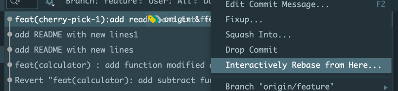
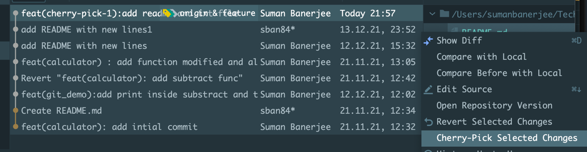

# Understand more Git version control

-- git commands 
### Basic Initial commands
```
git checkout -b "feature"
git status
git add <file_name(s)>
git commit -v

git log --online
git log --stat 
```

    commit c0ce53f73e042d304361858154bc3fe054c7a5ad (HEAD -> master, origin/master, origin/HEAD)


    feat(git_demo):add print inside substract

    adding a print statement

    main.py | 1 +
    1 file changed, 1 insertion(+)

    commit d2ea98e65510b3ad2fa85e2def9f5e8f09f5eae7


    Create README.md

    README.md | 1 +
    1 file changed, 1 insertion(+)
    commit a18f8029b8cf90cde330942eaf68c890a25d5b94
    feat(calculator): add intial commit
     .gitignore |  1 +
     main.py    | 20 ++++++++++++++++++++
     2 files changed, 21 insertions(+)

#### To get updated changes in a branch
```
// To get updated changes in a branch 

git checkout feature
git pull 

OR 
git fetch origin/feature
git status
git rebase -i origin/feature
git status


```
###1. modify the latest commit message 

####1.1
```
git commit --amend -m "add THE file name"
```
####1.2. modify any other commit message (not the latest )
````
git log --oneline

0f14564 (HEAD -> feature, origin/feature) add README file
37cb564 feat(calculator) : add function modified
1df334d Revert "feat(calculator): add subtract func"
c0ce53f (origin/master, origin/HEAD) feat(git_demo):add print inside substract
d2ea98e (master) Create README.md
a18f802 feat(calculator): add intial commit````

git fetch origin master

lets say we wanted to modify mesg of c0ce53f

git rebase -i HEAD~4

// this will pop up a window 
// select the commit and change from 'pick' to 'reword'
// save and quit

// this will pop up a window and edit the new msg
// save and quit

git log --online 
// will have all the new message older commits.
git push 


````


###2. Add a file into a latest commit 

git commit --amend 


###3. pick all files from any other branch's commit  into a specific branch ( solution is cherry-pick)
```
git checkout master 
git log 
get the commit hash_id which needs to be picked up
git checkout feature
git cherry-pick c0ce53f73e04
````
###3.1 pick selected files from the latest commit  into older commit ( solution is check-pick)


This is using IntelliJ / PyCharm IDE 

Scenario 1 #

Suppose we wanted to choose a file from a another commit from same branch 
lets say we are doing this operation in feature branch.

1. Open the git log in in IDE 
2. Select the commit where we wanted to add and right click and select "Interactively Rebase from here"
and a new window will open and there click one || / pause button by selecting the same commit.

   
3  Now back to the git log window and select the commit from where the changes are need to be picked up.
and select the file(s) and select "Cherry-Pick" 



and new window just select the checkbox and click "Amend" and Provide the message and 
click on "Commit" 


4. Terminal 
```
git push --force-with=lease

```


###4. Remove a commit from the branch 

get the commit hash_id which needs to be made as HEAD for that branch, i.e c0ce53f73e04 is commit that we need to remove permamnetly and previous commit to that is d2ea98e

```
git checkout <branch_name>
git reset --hard <commit_id_current_head>

// to clean untracked file 
git clean -df
```


###5. to get a commit which is been removed by git reset --hard command , 

```
git reflog 
```

d2ea98e (HEAD -> master) HEAD@{0}: reset: moving to d2ea98
c0ce53f (origin/master, origin/HEAD) HEAD@{1}: reset: moving to c0ce53f
c0ce53f (origin/master, origin/HEAD) HEAD@{2}: reset: moving to c0ce53f73e04
c0ce53f (origin/master, origin/HEAD) HEAD@{3}: reset: moving to c0ce53f73e04
c0ce53f (origin/master, origin/HEAD) HEAD@{4}: checkout: moving from feature to master
1c43ad4 (feature) HEAD@{5}: cherry-pick: feat(git_demo):add print inside substract
2d6aff7 HEAD@{6}: checkout: moving from master to feature
c0ce53f (origin/master, origin/HEAD) HEAD@{7}: checkout: moving from feature to master
2d6aff7 HEAD@{8}: commit (amend): add README file 


git checkout 1c43ad4
git branch backup
git checkout backup
git log 
// this backup branch will have all the changes what we had till 1c43ad4 commmit .


so this way we can get all the changes which might be lost after reset accidentally.

### 6. git revert : if we wanted to rever a change which is made as part of any previous commit
then we can use git revert , it will help to maintain clean git history

git log  
// get the commit for which the changes made are need to be reverted , 

git revert <commit_hash_id>

git add .
git commit -v

git push --force-with-lease
OR 

git push origin <branch_name>

// this way when others will pull the branch they will have clean history and can get the reverted changes.

###7. git rebase 

get the all latest changes / commits from master into feature branch 

````git checkout feature
git fetch origin master 
git rebase -i origin/master

// a window will open just quit
// this will get all the changes from master from the point feature is created and on top of that it will //replay all the subsequent commits from featire branch and create a upto date feature branch  will all //commits visible clearly. 
````
/*
NOTE : this may results conflicts BUT DONT WORRY 
Auto-merging main.py
CONFLICT (content): Merge conflict in main.py
error: could not apply 94409dd... feat(calculator): add THE subtract function
Resolve all conflicts manually, mark them as resolved with
"git add/rm <conflicted_files>", then run "git rebase --continue".
You can instead skip this commit: run "git rebase --skip".
To abort and get back to the state before "git rebase", run "git rebase --abort".
Could not apply 94409dd... feat(calculator): add THE subtract function
*/

resolve the conflicts from using IDE 

```git add . 
git commit -v
git push --force-with-lease
```


